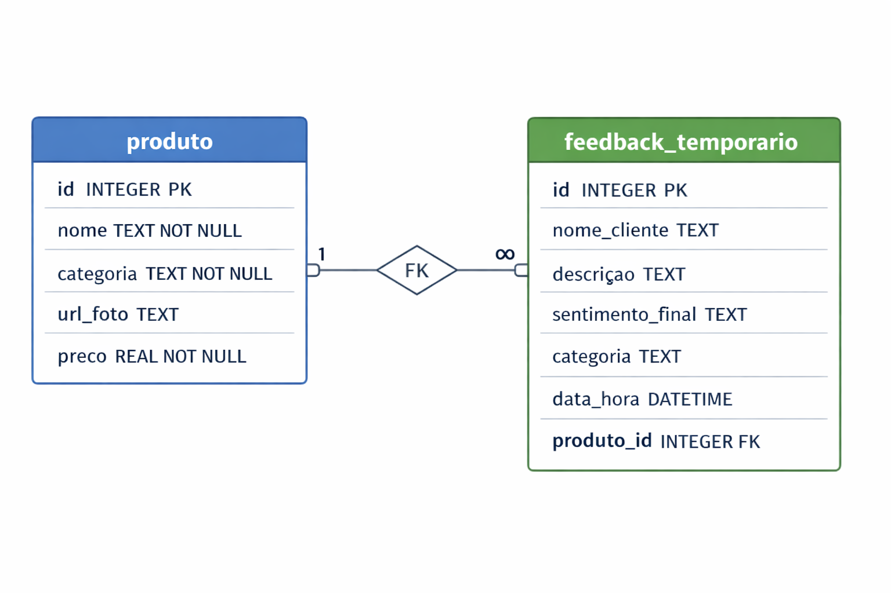

# Mercadinho do Seu Zé


Desde 1970, o Seu Zé acorda cedo pra escolher pessoalmente as melhores frutas e verduras.
O que antes era só no bairro, agora chega até você pelo iFood — com o mesmo cuidado de sempre.
Cada pedido carrega uma história: do campo, da colheita da semana, até a sua mesa

### Ajustes e melhorias
Esta POC (prova de conceito) não se limita a um site de vendas, mas incorpora recursos de inteligência artificial para elevar e personalizar a experiência do usuário. Embora tenha sido utilizada como demonstração prática para a empresa iFood, esta solução não se limita a essa aplicação, sendo de propriedade exclusiva do autor. O projeto encontra-se finalizado, com possibilidade de expansão futura conforme o interesse do autor.

O fluxo de negócio é simples: os produtos (verduras, frutas, etc.) são cadastrados no sistema e disponibilizados para compra diária pelos clientes. Após a compra, os usuários podem deixar feedbacks avaliando diferentes aspectos, como qualidade, preço, entrega, entre outros.
A inteligência artificial entra analisando automaticamente esses feedbacks, identificando o sentimento associado (positivo, negativo ou neutro) e classificando as principais categorias mencionadas (por exemplo: atraso na entrega, qualidade do produto, preço elevado).
Com isso, o gestor — o Seu Zé — passa a ter uma visão clara e estratégica do negócio, conseguindo identificar rapidamente pontos de melhoria, padrões de insatisfação e oportunidades de otimização na operação


Funcionalidades: 
O projeto encontra-se finalizado, com possibilidade de expansão futura conforme o interesse do autor.
- 📈 **Funcionalidades Gerais**
  - Cadastro de Produtos
  - Cadastro de Feedbacks
  - Listagem de Produtos
  - Listagem de Feedbacks

- 📈 **Dashboard de Analytics**
  - Reputação geral dos produtos. Nota variando 0-10.
  - Contagem de feedbacks positivos, negativos e neutros.
  - Visualização de gráficos de barras e pizza por produto e sentimento.
  - Principais categorias de problemas e elogios.
  - Filtros por produto e sentimento para análise personalizada.

- 📝 **Últimos Feedbacks**
  - Exibição dos três últimos feedbacks de cada produto.
  - Mostra cliente, descrição, sentimento e categorias.
  - Visualização da imagem do produto.

- 📝 **RAG**
  - Possibilidade de realizar indexação avulsa
  - Possibilidade de busca RAG pelas descrições dos feedbacks.

- 🧠🤖 **Recursos da Inteligência Artificial**
  - Reconhecimento de imagens após feito upload. O modelo utilizado foi: google/vit-base-patch16-224, que foi pré-treinado com mais de 14 milhões de imagens e 21.843 classes. O modelo reconhece frutas, vegetais comuns, mas não todos. Uma possível melhoria no futuro é realizado o fine-tuning desse modelo para reconhecer mais frutas e vegetais. Fonte: https://huggingface.co/google/vit-base-patch16-224 
  - Reconhecimento de sentimentos. Modelo pré-treinado usado: tabularisai/multilingual-sentiment-analysis. Suporte 23 idiomas e classifica textos em sentimentos em cinco categorias: muito negativo, negativo, neutro, positivo, muito positivo. Fonte: https://huggingface.co/tabularisai/multilingual-sentiment-analysis
  - Reconhecimento de categorias no feedbacks. Modelo zero-short pré-treinado usado: MoritzLaurer/mDeBERTa-v3-base-mnli-xnli. Suporta mais de 100 idiomas.
  Fonte: https://huggingface.co/MoritzLaurer/mDeBERTa-v3-base-mnli-xnli

 O modelo de reconhecimento de imagens retorna textos em inglês e para tradução para português usamos a ferramenta translate.
 O modelo de toxicidade (reconhecer comentários maldosos, linguagem ofensiva como, por exemplo, uso de palavrões) está citado no código, mas no momento não foi usado. Fonte: https://huggingface.co/unitary/toxic-bert.

✅ Banco de Dados
 - O banco de dados utilizado foi o SQLLite, sendo todo o banco mantido no arquivo ifood_app.db. Funções para manipulação como, por exemplo, excluir todos os registros de todas as tabelas encontram-se na pasta bd/Banco_de_dados_uteis.ipynb. Atualmente, a aplicação não permite a exclusão ou alteração de produtos e feedbacks por meio da interface gráfica. Essa funcionalidade pode ser incorporada como melhoria futura. Embora haja a citação de outras tabelas como, por exemplo, pedido, no momento apenas tabelas estão disponíveis: PRODUTO e FEEDBACK_TEMPORARIO.



## 💻 Pré-requisitos

Antes de começar, verifique se você atendeu aos seguintes requisitos:

- Você instalou ou tem  a versão `<Python 3.11>`
- Você tem uma máquina `<Windows / Linux / Mac>`. 

## 🚀 Instalando Mercado do Seu Zé

É altamente recomendável utilizar ambiente virtual para uso do projeto.
Para instalar o Mercado do Seu Zé, siga estas etapas:

1. Criar o ambiente virtual conda
```
conda create -n ifood_env python=3.11
```

2. Ativar o ambiente
```
conda activate ifood_env
```

3. Verificar se o ambiente está ativo
```
conda info --envs
```

4. Instalar as dependêndias
Certifique-se de estar na pasta do projeto (onde está o requirements.txt):
```
pip install -r requirements.txt
```


## ☕ Usando Mercado do Seu Zé

Considere estar na pasta do projeto e o streamlit está rodando.

```
streamlit run streamlit_app.py
```
Uma página do navegador deverá ser aberta, correspondente à aplicação rodando em tempo real.
Para interromper a execução da aplicação, basta pressionar Ctrl + C no terminal onde o Streamlit está sendo executado.

## 📫 Contribuindo para Mercado do Seu Zé

Para contribuir com Mercado do Seu Zé, siga estas etapas:
1. Notifique o autor com a modicação, veja a seção contato.
2. Bifurque este repositório.
3. Crie um branch: `git checkout -b <nome_branch>`.
4. Faça suas alterações e confirme-as: `git commit -m '<mensagem_commit>'`
5. Envie para o branch original: `git push origin <nome_do_projeto> / <local>`
6. Crie a solicitação de pull.


## 🤝 Colaboradores
Agradecemos às seguintes pessoas que contribuíram para este projeto:

<table>
  <tr>
    <td align="center">
      <a href="https://www.rogersampaio.com" target="_blank">
        <br>
        <sub>
          <b>Roger Cavalcante Sampaio</b>
        </sub>
      </a>
    </td>
  </tr>
</table>

<p>
  <a href="https://www.linkedin.com/in/roger-csampaio/" target="_blank">LinkedIn</a><br>
  <a href="https://www.youtube.com/@roger_sampaio" target="_blank">YouTube</a><br>
  <a href="mailto:rogersampaioo@gmail.com">E-mail</a>
</p>


## 😄 Seja um dos contribuidores

Entre em contato com Roger Sampaio: rogersampaioo@gmai.com

## 📝 Licença

Esse projeto está sob licença. Veja o arquivo [LICENÇA](LICENSE.md) para mais detalhes.
